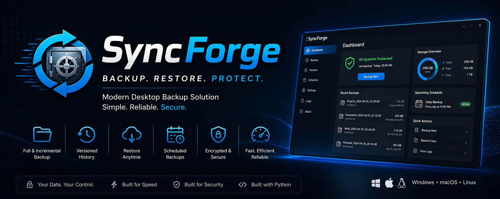

# SyncForge

<p align="center">
  
</p>

<p align="center">
  <strong>A modern desktop backup console for secure, reliable folder protection.</strong>
</p>

<p align="center">
  
  
  
</p>

---

## 💡 About SyncForge

SyncForge is a powerful yet simple desktop backup application designed to protect your important files with ease.

Built with a clean modern interface and a reliable backup engine, SyncForge helps you create, manage, and restore backups without complexity.

---

## ✨ Features

* 🔄 Full and incremental folder backups
* 🕒 Automatic scheduled backups (daily / weekly)
* 🔐 Password-based encryption for secure backups
* 📦 Optional ZIP compression
* 📂 Backup history with restore support
* ⚡ Real-time progress and logging system
* 🖥️ Clean dark UI with smooth user experience
* 💾 Storage overview and external drive support

---

## 📸 Preview


---

## 🚀 Download

👉 [Download SyncForge v1.0](https://github.com/EnukaSathmina/SyncForge/releases)

---

## ▶️ Getting Started

1. Download the latest version from the link above
2. Extract the file (if zipped)
3. Run `SyncForge.exe`

No installation required — fully portable.

---

## ⚠️ Notes

* On first launch, Windows may show a security warning.
  Click **"More info" → "Run anyway"** to continue.
* Make sure to keep your encryption password safe.
  Encrypted backups cannot be restored without it.

---

## 💎 Why SyncForge?

* Simple and intuitive design
* Powerful backup engine with incremental support
* Secure encryption for sensitive data
* Designed for both everyday users and developers

---

## 📦 Backup Structure

```text
BackupDestination/
  Documents_2026-05-02_18-30-00/
    Documents/
      file1.txt
      Projects/
        file2.txt
  metadata.json
```

---

## 🔒 License

SyncForge is proprietary software.

All rights reserved. You may not copy, modify, or distribute this software without permission.

---

## 👨‍💻 Developer

Developed by **Enuka Sathmina**

© 2026 All Rights Reserved
